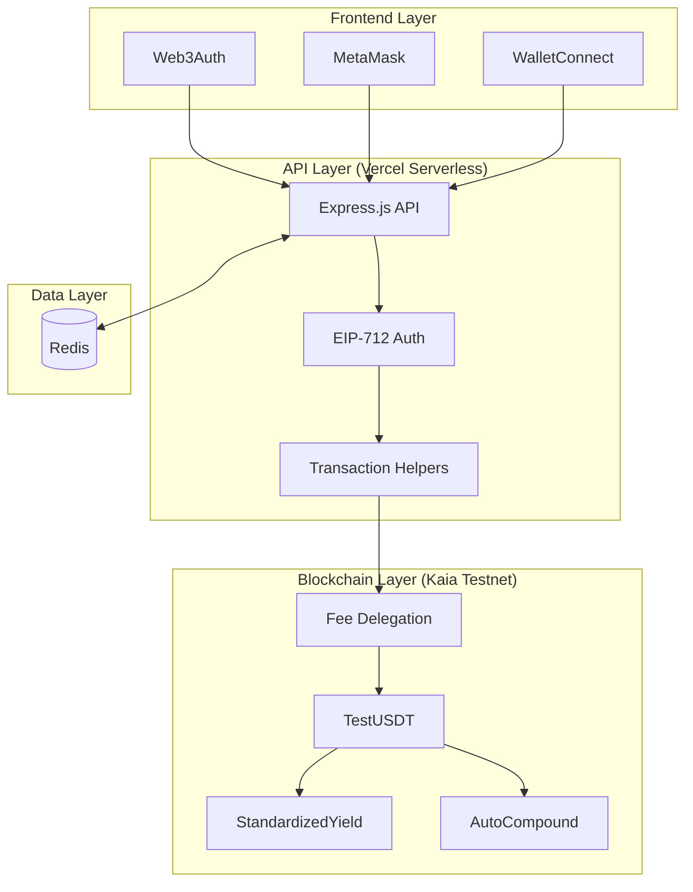
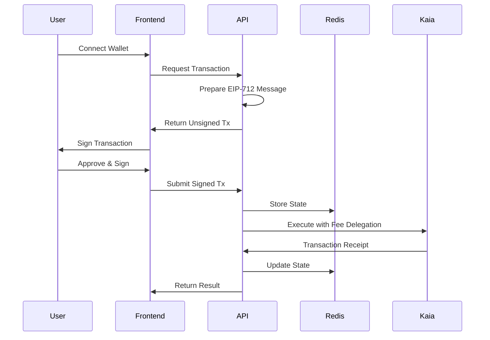

# LineX - Cross-Border DeFi Platform

**Web3-native remittance platform with integrated yield farming on Kaia blockchain**

## 🏗️ Architecture Overview



## 👥 User Personas & Workflows

### 🧑‍💼 Bob - Conservative Investor
**Profile**: Risk-averse user seeking stable, diversified yields

```typescript
// Bob's Workflow: StandardizedYield Multi-Strategy Vault
const bobWorkflow = {
  vault: "StandardizedYield",
  strategy: "Multi-strategy diversified",
  allocation: {
    lending: "40%",  // 10% APY
    staking: "35%",  // 8% APY  
    liquidity: "25%" // 12% APY
  },
  expectedAPY: "9.5%",
  riskLevel: "LOW",
  address: "0x36033918321ec4C81aF68434aD6A9610983CCB63"
};

// Bob's deposit flow
POST /api/v1/defi/approve-request
  → POST /api/v1/defi/deposit-request
    → Vault.deposit(assets, receiver)
      → Automatic strategy diversification
```

### 👩‍💻 Alice - Yield Maximalist
**Profile**: Aggressive investor optimizing for maximum returns

```typescript
// Alice's Workflow: AutoCompound Single-Strategy Vault
const aliceWorkflow = {
  vault: "AutoCompoundVault",
  strategy: "Single-strategy auto-compound",
  features: {
    autoHarvest: true,
    compoundOnDeposit: true,
    gasOptimized: true
  },
  expectedAPY: "10-12%",
  riskLevel: "MEDIUM-HIGH",
  address: "0x02c83bD37d55AA5c3c2B4ba9D56613dD4c16A7D0"
};

// Alice's deposit flow
POST /api/v1/defi/approve-request
  → POST /api/v1/defi/deposit-request
    → Vault.deposit(amount)
      → Auto-harvest → Compound → Reinvest
```

## 🔄 Request Flow Architecture



## 💻 Code Structure

```
src/
├── api/                     # API Routes
│   ├── middleware/         # Auth, CORS, validation
│   ├── routes/            # Core endpoints
│   └── v1/
│       └── defi/          # DeFi-specific routes
│           ├── index.ts          # Portfolio & positions
│           ├── vault.ts          # StandardizedYield
│           ├── autocompound.ts   # AutoCompound
│           └── transactionHelpers.ts # Tx preparation
├── services/
│   ├── blockchain/        # Kaia integration
│   │   ├── provider.ts          # Network connection
│   │   ├── feeDelegationService.ts # Gasless txs
│   │   └── simpleContractService.ts # Contract calls
│   ├── defi/              # Vault services
│   │   ├── syVaultService.ts    # StandardizedYield
│   │   └── autoCompoundVaultService.ts # AutoCompound
│   └── redis/             # Data persistence
└── contracts/
    ├── src/
    │   ├── core/
    │   │   ├── StandardizedYield.sol  # Bob's vault
    │   │   └── AutoCompoundVault.sol  # Alice's vault
    │   └── strategies/
    │       ├── MockLendingStrategy.sol
    │       ├── MockStakingStrategy.sol
    │       └── MockLPStrategy.sol
    └── test/              # 50+ comprehensive tests
```

## 🔑 Key Services Implementation

### Fee Delegation Service
```typescript
// src/services/blockchain/feeDelegationService.ts
export class FeeDelegationService {
  async executeWithFeeDelegation(
    signedTx: string,
    userAddress: string
  ): Promise<TransactionReceipt> {
    // 1. Verify EIP-712 signature
    const recovered = this.recoverSigner(signedTx);
    if (recovered !== userAddress) throw new Error("Invalid signature");
    
    // 2. Prepare fee delegated transaction
    const feeDelegatedTx = {
      type: TxType.FeeDelegatedSmartContractExecution,
      from: userAddress,
      gas: 500000,
      // Platform pays gas
      feePayer: this.gasPayerAddress
    };
    
    // 3. Execute transaction
    return await this.provider.send(feeDelegatedTx);
  }
}
```

### Portfolio Aggregation Service
```typescript
// src/api/v1/defi/index.ts
router.get('/portfolio/:userAddress', async (req, res) => {
  // Fetch balances from both vaults
  const syBalance = await syVaultService.getBalance(userAddress);
  const acBalance = await autoCompoundService.getBalance(userAddress);
  
  // Calculate with proper decimal scaling (USDT = 6 decimals)
  const syValue = parseFloat(syBalance.underlyingAssets) / 1e6;
  const acValue = parseFloat(acBalance.underlyingAssets) / 1e6;
  
  // Return aggregated portfolio
  return {
    totalValueUSD: syValue + acValue,
    averageAPY: (syValue * 0.095 + acValue * 0.105) / totalValue,
    positions: [
      { vault: "StandardizedYield", value: syValue, apy: 0.095 },
      { vault: "AutoCompound", value: acValue, apy: 0.105 }
    ]
  };
});
```

### Transaction Helper Pattern
```typescript
// src/api/v1/defi/transactionHelpers.ts
router.post('/deposit-request', async (req, res) => {
  const { vaultType, vaultAddress, userAddress, amount } = req.body;
  
  // Prepare transaction based on vault type
  let depositData: string;
  if (vaultType === 'standardized-yield') {
    // Bob's vault: deposit(uint256 assets, address receiver)
    depositData = vaultInterface.encodeFunctionData('deposit', [
      amount, userAddress
    ]);
  } else {
    // Alice's vault: deposit(uint256 amount)
    depositData = autoInterface.encodeFunctionData('deposit', [amount]);
  }
  
  // Return unsigned transaction for frontend signing
  return {
    txRequest: {
      type: TxType.FeeDelegatedSmartContractExecution,
      from: userAddress,
      to: vaultAddress,
      data: depositData,
      gasLimit: 500000
    }
  };
});
```

## 🚀 Quick Start

```bash
# Install dependencies
pnpm install

# Start development with Redis
pnpm run dev:redis

# Run contract tests
pnpm run forge:test

# Deploy contracts
pnpm run forge:deploy:testnet

# Build for production
pnpm run vercel-build
```

## 📊 API Endpoints

### Core DeFi Operations
```typescript
// Portfolio Management
GET  /api/v1/defi/portfolio/:address    // Aggregated portfolio
GET  /api/v1/defi/positions/:address    // Active positions
GET  /api/v1/defi/transactions/:address // Recent transactions

// Transaction Preparation (Frontend signs, backend executes)
POST /api/v1/defi/approve-request       // ERC20 approval
POST /api/v1/defi/deposit-request       // Vault deposit
POST /api/v1/defi/withdraw-request      // Vault withdrawal  
POST /api/v1/defi/transfer-request      // ERC20 transfer

// Vault Information
GET  /api/v1/defi/vaults                // Available vaults
GET  /api/v1/defi/strategies            // Strategy details
```

## 🧪 Testing

```bash
# Unit Tests (50+ tests)
pnpm run forge:test

# Integration Tests
./e2e-test-bob.sh    # StandardizedYield workflow
./e2e-test-alice.sh  # AutoCompound workflow

# API Tests
curl -X POST localhost:3000/api/v1/defi/portfolio/0x...
```

## 🏗️ Smart Contract Architecture

```solidity
// StandardizedYield.sol - Bob's Multi-Strategy Vault
contract StandardizedYield is ERC4626, Ownable, Pausable {
    struct Strategy {
        IYieldStrategy strategy;
        uint256 allocation; // Basis points (10000 = 100%)
    }
    
    Strategy[] public strategies;
    
    function _deployToStrategies(uint256 amount) internal {
        for (uint256 i = 0; i < strategies.length; i++) {
            uint256 strategyAmount = (amount * strategies[i].allocation) / 10000;
            strategies[i].strategy.deposit(strategyAmount);
        }
    }
}

// AutoCompoundVault.sol - Alice's Auto-Compound Vault
contract AutoCompoundVault is Ownable, Pausable, ReentrancyGuard {
    IYieldStrategy public strategy;
    uint256 public lastHarvest;
    
    function deposit(uint256 amount) external nonReentrant {
        _harvestIfNeeded(); // Auto-compound on deposit
        uint256 shares = _calculateShares(amount);
        _mint(msg.sender, shares);
        underlyingAsset.safeTransferFrom(msg.sender, address(this), amount);
        _deployToStrategy(amount);
    }
}
```

## 🔄 Data Flow Patterns

### Redis Key Structure
```typescript
// User data (JSON)
user:{walletAddress} → {
  address: string,
  createdAt: timestamp,
  lastActive: timestamp
}

// Transfer state (JSON, TTL: 24h)  
transfer:{id} → {
  id: string,
  from: address,
  to: address,
  amount: string,
  status: 'pending' | 'completed' | 'failed'
}

// Quote data (JSON, TTL: 5min)
quote:{id} → {
  fromCurrency: string,
  toCurrency: string,
  amount: string,
  rate: number
}
```

## 🛠️ Development Commands

```bash
# Development
pnpm run dev              # Start dev server
pnpm run dev:redis        # Start with Redis
pnpm run build            # Build TypeScript

# Testing
pnpm run forge:test       # Contract tests
pnpm run lint             # ESLint check
pnpm run format           # Prettier format

# Deployment
pnpm run vercel-build     # Production build
pnpm run forge:deploy:testnet # Deploy contracts
```

## 📈 Performance Metrics

- **API Response Time**: < 500ms
- **Transaction Execution**: < 15 seconds
- **Gas Optimization**: 500,000 gas limit for complex operations
- **Decimal Precision**: 6 decimals (USDT), 18 decimals (Vault shares)

## 🔒 Security Model

```typescript
// EIP-712 Signature Verification
const domain = {
  name: "LineX DeFi",
  version: "1",
  chainId: 1001,
  verifyingContract: vaultAddress
};

const types = {
  Deposit: [
    { name: "user", type: "address" },
    { name: "amount", type: "uint256" },
    { name: "nonce", type: "uint256" },
    { name: "deadline", type: "uint256" }
  ]
};

// User signs message, backend verifies and executes
```

## 📚 Resources

- **Technical Guide**: [CLAUDE.md](./CLAUDE.md)
- **Contract Documentation**: [contract_guide.md](./contract_guide.md)
- **API Documentation**: http://localhost:3000/api/docs
- **Kaia Explorer**: https://kairos.kaiascan.io

---

**LineX** - Building the future of cross-border DeFi with user-centric design and economic sustainability.